Download this page as a [PDF](manual.pdf) or [Epub](manual.epub).
 Comments or questions? Email us at <crispor@tefor.net>.

What is CRISPOR?
================

[CRISPOR](http://crispor.org) is a website that helps select and express CRISPR guide sequences.  In
its default mode, the user pastes an input DNA sequence and chooses the genome.
CRISPOR then lists the guides in the input sequence, adding information about
them found in databases and algorithms, including genome variants, predicted
off-target and on-target scores. For each guide sequence, various primers
are designed, e.g. to amplify the target, produce guide RNAs by in vitro
transcription after annealing of overlapping primers or for cloning into
AddGene plasmids.

A second, optional mode, called CRISPOR Batch, is available for users who want
to use pre-selected guide RNAs for gene inactivation experiments in mouse or
human cells. It accepts one or multiple gene identifiers and returns a number
of pre-selected guides from various genome-wide libraries as well as
primers with overhangs for cloning into guide RNA expression plasmids and with
sequence information preformatted for easy ordering from oligo-array
manufacturers.

Additional assistants in CRISPOR design primers for all predicted
off-targets of a guide and create oligonucleotide pools for saturating
mutagenesis of the input sequence.

Below, we provide a step by step manual of CRISPOR and instructions on how to
use the assistants. Important information is also directly available on the
web pages by hovering the mouse over the small info bubbles shown in
orange. Usually, orange colour indicates links which can be clicked for further
information or more detailed CRISPOR results.

Input {#inputform}
=====

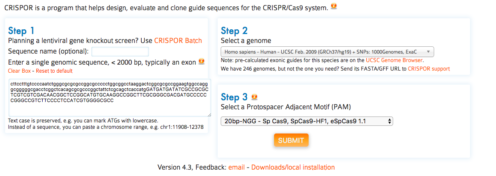

On the first page of CRISPOR.org, you have to enter only three pieces of information:

1. Input Sequence: paste your target sequence into the input sequence box. No
special sequence format is required (FASTA accepted).  Characters other than
A, C, G, T and N will be automatically removed from the pasted sequence. A
warning will be displayed during processing if characters were removed.

    - the input sequence is usually genomic DNA sequence but any input sequence can be submitted
    - your input sequence should usually be contained in the selected genome, but it may
      not be present, e.g. if you are designing guides against a transgene, like
      GFP. A warning will appear in this case.
    - cDNA: This warning will also appear if you
      have accidentally used cDNA sequence as input. Using cDNA will usually not work
      since guide sequences that overlap exon-exon boundaries will not have bona
      fide targets in the genome. Also cDNAs from PCR will often include PCR errors.
    - if all you have is a cDNA sequence, please use BLAST or BLAT first to obtain 
      exons. Pick one of the exons and use these as the input for CRISPOR. Pasting cDNA
      sequences is still one of the most common mistakes when using a CRISPR design 
      tool.
    - character case of the input sequence will be retained in the output. As such, you can 
      mark any sequence of interest (exons, ATG or stop codons, coding
      sequence of catalytic sites, …) using upper/lower case in order to easily
      visualize where the different guide sequences are positioned relative to
      these features in the output. 
    - if the input sequence contains N-characters (“aNy” nucleotide), no guides
      will go over these characters, so you can mark positions that you want to
      exclude from the design with Ns, e.g. to avoid single nucleotide
      polymorphisms (SNPs also known as SNVs, single nucleotide variants).
    - you can give your input sequence an optional name. It will be shown on the
      output page and appended to all oligonucleotides that you download later.
    - if you can want to check multiple guides with a single CRISPOR run, you
      can separate them with two N characters. In this way, not NGG pattern will go across them.
      However, the efficiency scores cannot be calculated, as there is not enough 
      context.

2. Genome: Select your genome of interest from the list. 
You can scroll through and select from the drop-down or
type and search the names of the species, using latin or English common names. 

    - a default genome will be automatically set to the last genome that you selected.
    - we have imported numerous genomes already. Some species are available
      multiple times, e.g mouse and human, because assemblies from different years
      are available and some loci are only part of certain assembly releases. Also,
      the annotation with variants (SNPs and short indels, see below) is only
      available for certain assemblies. This is shown as part of the genome
      list, e.g. the 1000 Genomes variant annotation is only available for the
      human genome assembly called “hg19” (aka GrCh37).
    - if your genome is not on the list, please [contact us](mailto:crispor@tefor.net) and send us a link to
      the fasta file and ideally also GFF gene annotations and the common and
      scientific names, e.g. “zebrafish” and “Danio rerio”. If your genome is in
      NCBI RefSeq or on the UCSC or Ensembl browsers, please send us the NCBI
      assembly accession ID or a link to the UCSC or Ensembl page. We have added
      more than 150 genomes since the publication of the CRISPOR paper.

3. Protospacer Adjacent Motif (PAM): For most current applications of the CRISPR-Cas system, Streptococcus pyogenes Cas9 nuclease is used and the corresponding PAM is NGG, the default. However, you can choose other enzymes and corresponding PAMs from the dropdown box. 

Output 1: Annotated input sequence {#annotseq}
==================================

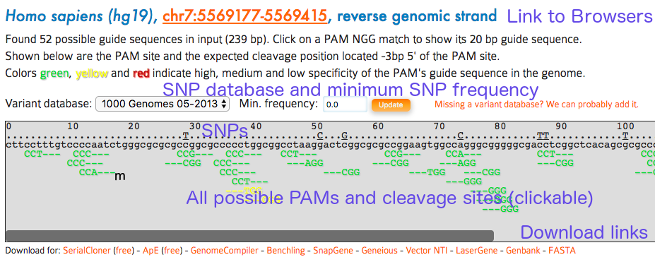

The main output of CRISPOR is a page that shows the annotated input sequence
at the top and the list of possible guides in the input sequence at the bottom. 

The input sequence is shown first. Underneath the sequence, all PAM
(Protospacer adjacent motif) sites are highlighted. Most labs use
Sp-Cas9, its PAM is NGG. Sp-Cas9 usually cuts three or four basepairs 5&lsquo; of the
PAM site. The three bases 5’ of the PAM are marked with dashes (“-”) to help
users find the cleavage position. PAM sites can also be on the reverse strand
of the input sequence. For Sp-Cas9, these correspond to CCN motifs on the input
sequence and the dashes are shown on the right side of the PAM in this case.
PAMs are clickable and link to the corresponding target row in the table of
guides below (see next section).

- you can send the URL of the output page to collaborators or bookmark it.
  We have not yet deleted any results over the last two years and try to keep
  the output for at least a year. For long-term archival, consider downloading
  the page and/or the Excel spreadsheets.

- the position of the input sequence in the selected genome is shown at the
  top of the main CRISPOR results page. A click onto this position will open
  a new window with a genome browser, usually UCSC or Ensembl, depending on
  the source of the genome. If the input sequence was not found in the selected
  genome, a warning is displayed (see note in section here above).
- for certain genomes, the input sequence can be annotated with variants,
  mostly SNPs. The variants are shown above the input sequence. You can hover
  with your mouse over them, to show details about the variant, usually the
  nucleotide change (T->G) and the frequency. You can change the variant
  database and you and also set a minimum frequency for variants shown on the
  page. Any variant that has a frequency below the threshold will not be
  displayed. 
- very few genomes (human and mouse) have variants in our database at the
  moment. If you need a particular one, [contact us](mailto:crispor@tefor.net) by email and send us the URL
  of the database or the VCF file.

Output 2: Guide list {#guidelist}
====================

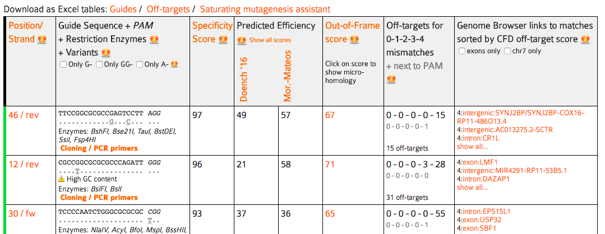

Shown below the input sequence are the guide target sequences, one per PAM. For
spCas9, the PAM is NGG and the targets are 20bp long. Each 20bp target sequence
in the input sequence is aligned against the whole genome allowing at most four
mismatches and the results are summarized as a table. The table has the columns
described below. To sort by one of them, click its name in the first row. 

By default, the table rows are sorted by specificity score. To sort by values
of any other column, click the name of the column in the first row.

Column 1 - guide name: this is the position of the PAM on the
input sequence and the strand, e.g. "13+". You can sort by position by clicking
the header "Position/Strand" in the table. The position is always on the forward
strand of the reference genome, 5'-3' on the DNA, so if the input sequence is
on the reverse strand, position 1 in this table will be the last base pair of
the input sequence. (In general, we do not recommend entering sequences on the
reverse strand. it makes everything easier if you always keep genomic sequences
on the forward strand, even if transcription can go backwards, CRISPR modifies
the genome and having all sequences in one direction makes any position
information easier to calculate in your head and to display in genome browsers 
and related tools.)

Column 2 - guide sequence: the sequence of the guide target and the PAM and also
one of the most important features of CRISPOR, the link to its "PCR and cloning primers"
(see the [Primers section](#primers) below).

In addition, depending on the genome and guide, additional data is displayed in the guide sequence column:

- variants are indicated underneath the target sequence and PAM, if variants
  are available for this genome. 
- High-GC-content (>80%) guides are flagged, as are low-GC content (<20%)
  targets. Various studies have reported that both cases lead to low target
  cleavage efficiency.
- Graf et al. guides are flagged. Some motifs were described by 
  [Graf et al](https://www.ncbi.nlm.nih.gov/pmc/articles/PMC6352712/) as
  leading to very inefficient guides. See below for more details.
- Restriction enzyme sites that overlap the three base pairs 5’ of the PAM
  site.  These will likely be disrupted during DNA repair of the double-strand
  break made by the Cas9 nuclease and may therefore be convenient to use for
  screening of mutant sequences amplified by PCR.
- Also shown in this column are restriction enzymes that overlap the three
basepairs 5&lsquo; of the PAM site. Finally, one of the most important features
of CRISPOR is available here, under the link "PCR primers" . 
 
This column allows to filter the guides by the first nucleotide, as some RNA
expression promoters can only transcribe guides that start with certain
nucleotides.  Some labs only use targets that start with G- for the U6
promoter, A- for the U3 promoter or G- for the T7 promoter. In this way, no
further sequence changes are necessary. In our lab, we do not constrain guides
in this way, but simply prefix them with the required nucleotide as a 21st
basepair (see the [Primers section](#primers) below).

Column 3 - specificity score: this score is a prediction of how much an
RNA guide sequence for this target may lead to off-target cleavage somewhere
else in the genome. The score ranges from 0-100 with 100 being the best,
meaning the search could not find a single sequence in the genome that differs
from the target at up to four positions. This score uses the formula from the
MIT Crispr Website (Hsu guide score) but with a better and more sensitive search engine. We think
that good guides should have a specificity score of at least 50, based on the
data from whole-genome off-target assays, see Figure 3a in the [CRISPOR
paper](http://genomebiology.biomedcentral.com/articles/10.1186/s13059-016-1012-2).
The color of the guide (red/yellow/green) is based on the specificity score
(>50 = green, >30 = yellow). You should avoid guides with very low scores, unless you
can validate the off-targets with special assays or you can cross or inbreed
the animals until you are sure that no off-targets are left. SaCas9 now has its
own specificity score provided by [Josh
Tycko](https://www.ncbi.nlm.nih.gov/pmc/articles/PMC6063963/), so this column
will appear for SaCas9, but there is no such score for Cpf1 yet.

Column 4 - efficiency scores: the efficiency score is a prediction of how well this
target may be cut by its RNA guide sequence. It ranges from 0-100 with 100 being the best.
We show two scores here: the scoring method from the Doench 2016 paper (aka "sgRNA
Designer") or the one by Moreno-Mateos 2016 ("CrisprScan"). In our study, we found
that the Doench 2016
score is the best score for guides expressed in the cells from a U6 promoter, see 
Figures 4 and 5 in our [CRISPOR
paper](http://genomebiology.biomedcentral.com/articles/10.1186/s13059-016-1012-2).
The Moreno-Mateos2016 score was better in our study when the guide was expressed in-vitro with
a T7 promoter. While there is link in the header of this column to show various other
scores in the table, we do not recommend the other algorithms anymore, based on
the results from our paper. Note that the Doench 2016 scores slightly changed
in April 2018, when we updated to the version called 'Azimuth', which is also used by
the Broad Institute's website, but the changes were on the order of 1-2%, so it
did not make any difference in practice.

Cpf1 and saCas9 have special efficiency scores, the spCas9 scores are not applicable
for them, and the models "deepCpf1" for Cpf1 and "Najm et al 2018" for saCas9 will be shown here.

Also, the predictive power of these scores is not great in general, with 
correlations of around 0.4 against the assay results. If you have no choice and
need to pick certain guides, you may choose to ignore efficiency scores. If you
have a choice between many specific guides, however, or you are screening many
guides, you may want to prefer guides with high efficiency scores. For a more
detailed discussion of this topic, see our [Notes on on-target
cleavage](#onEff) below.

Column 5 - out-of-frame score : this score (0-100) is a prediction how likely a
guide is to lead to out-of-frame deletions. This is relevant if you are doing
gene knockouts with a single guide. Gene knockouts with single guides work
because repair after DNA cutting is error-prone and small deletions are
introduced 5' of the PAM. It has been observed by Bae et al. that this repair
does not lead to a random distribution of small deletions, but that due to
microhomology around the cut site, certain deletions are favored, depending on
their flanking DNA sequences. You can click on this score to show what the
predicted deletions are, in order of their predicted microhomology. We know of at
least one case where it was impossible to obtain a gene knock-out with a
specific guide because all deletions seen after sequencing were always
in-frame (T. Momose, unpublished data). The higher the out-of-frame score, the
more deletions have a length that is not a multiple of three, see [Bae et
al.](http://www.nature.com/nmeth/journal/v11/n7/full/nmeth.3015.html).

Column 6 - off-target mismatch counts: the number of possible off-targets in
the genome, for each number of mismatches. This is a summary of
the whole-genome search for sequences similar to the guide target sequence.
It is best explained by an example:
a description "0 - 1 - 2 - 9 - 28" means that the target matches 0 locations in
the genome with no mismatch, 1 location in the genome with 1 mismatch, 2
locations with 2 mismatches, 9 with 3 and 28 locations with 4 mismatches. The
smaller numbers in grey below use the same scheme, but only for locations with
no mismatch in the 12 bp close to the PAM, the "seed" region. Early reports
based on in-vitro cleavage assays suggested that off-targets with a mismatches
in the seed region are very inefficiently cut. If the grey numbers are "0 - 0 -
1 - 7 - 2" this means that there is one location in the genome where the target
matches with three mismatches and all three mismatches are outside the seed
region, 7 locations with 4 mismatches outside the seed region and 2 locations
with four mismatches outside the seed region. The total number of off-targets
is shown in this column, too. For detailed discussion of the topic of off-target searching, 
see our [Notes on off-target cleavage](#offs) below.

Column 7 - off-targets: here CRISPOR lists the locations of all possible off-targets
with up to four mismatches, annotated with additional information:
- genomic position and an annotation whether they
fall into an exon, intron or between genes and the closest gene. 
- you can hover
with your mouse over the position to show an alignment of the guide sequence
with the off-target and two off-target scores, CFD (Cutting frequency
determination) and MIT.

- by default only the three most likely off-targets are shown, click on “show
  all” to see more.
- when the "show all" is active, a link to "Off-target primers" is visible.
  This is a tool for bulk primer design, see [Off-target primers](#otPrimers) below.
- it is possible to shown only off-targets in exons or off-targets on
  the same chromosome as the target. Exonic off-targets are more likely
  to have a functional impact. When working with experimental organisms,
  off-targets lying on a different chromosome than the target will not
  cosegragate and will be diluted out during breeding.
- All off-targets are sorted by an "off-target score" which tries to predict
  what the most likely off-targets are. The score is based on where the
  mismatches are. Usually, a mismatch close to PAM means that the off-target is
  less likely. See our [Notes on off-target cleavage](#offs) below
  for more details.
- For some genomes, there is no exon filter. This is the case when we could
  not find a valid gene model (GFF) file for the genome. Do not hesitate to
  [contact us](mailto:crispor@tefor.net) by email if you have a gene model file or want us to add one.
- When searching for off-targets, CRISPOR is somewhat more tolerant and allows
  not only NGG, but also NGA and NAG, as these have been found to be quite
  common in the Tsai et al study, up to 10% of off-target events had non-NGG
  PAMs. Other enzymes have similar flexibility, GAW for NGN and NKG PAMs, NGG
  for NGA PAMs, and NNGRRN for NNGRRT PAMs. The tool-tip in the off-target
  column always shows the currently allowed non-canonical PAMs tolerated in the
  off-target search phase.

Output 3: Primers
=================

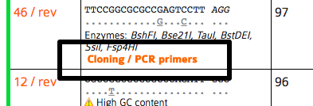

The third main page of CRISPOR is the list of primers related to a selected guide. You 
reach it by clicking "Cloning / PCR primers" for a particular guide in the table.

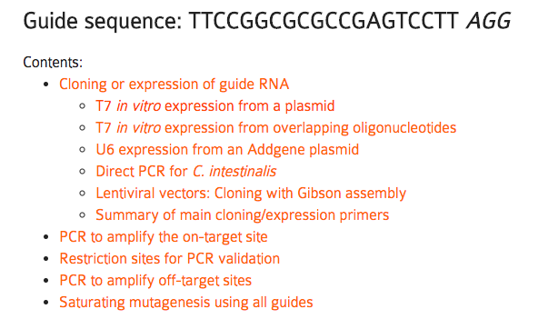

The top part of the page ("Cloning or expression of guide RNA") shows
expression primers. There are many possible ways for
guide expression supported by CRISPOR. The choice depends on your organism
(mice/zebrafish vs. cell cultures) and preferred cloning method. We tried to
link to useful protocols on this page, too. If this page is missing support for
your favorite system or protocol, do not hesitate to [contact us](mailto:crispor@tefor.net). For quicker 
copy/pasting into Excel, this section contains a table with a copy of all
primers at the end ("Summary of main cloning/expression primers").

The second part of this page ("PCR to amplify the on-target site") shows one
pair of primers to amplify a fragment of the genome around the target site, to
validate cleavage, e.g. with the T7 endo assay, by analyzing your Sanger traces with
[TIDE](https://tide.nki.nl/) or [ICE](https://ice.synthego.com/#/), NGS
sequencing analyzed with [Crispresso](http://crispresso.rocks/) or by
restriction digest (see below).  You can change the size of the fragment and
the Tm of the primers here to optimize the PCR design to the specific assay.

The third part of this page ("Restriction sites for PCR validation") lists
restriction enzymes that overlap the position 3bp 5&lsquo; of the PAM. If a PCR
product of the primers above is not cut with the enzyme anymore, 
it is very likely that the genome had been changed by Cas9 successfully, usually 
with a short deletion. This is quicker in the lab than sequencing or T7 endonuclease
assays and can be very useful for routine screening during breeding of mutant animals.

To make sure that your restriction site is unique enough in the PCR fragment to
be visible on a gel, the sites are shown on the PCR fragment sequence shown
below. The sizes of the individual sub-fragments are shown, too.

Finally, there are links at the bottom of the page to design primers for all off-targets of this
guide (see next section) and also a link to download all guides in the input sequence
for saturating mutagenesis, e.g. of non-coding regions (see below).

CRISPOR off-target primer assistant {#otPrimers}
===================================

High-throughput sequencing is the most accurate way of determining off-target
cleavage. By ordering oligos and running arrayed PCRs e.g. on 96-well
plates, you can validate up to several hundred off-targets relatively
quickly. The off-target primer designer of CRISPOR outputs not only one pair of
primers for each off-target with the right overhangs for Illumina adapter
addition, but also creates an input file for CRISPRESSO.
CRISPRESSO (http://crispresso.rocks) is a software package for the analysis of
FASTQ files from sequencing, it can e.g. plot histograms with the distribution
of indels 5&lsquo; of the PAM site and calculate p-Values for them.

For off-target amplification, we recommend the protocol by Matt Canver where
two PCRs are run: one PCR to amplify the potential off-target, then a second
PCR to extend the handles with Illumina barcodes. You can download the protocol
[here](http://crispor.tefor.net/downloads/prot/canverProtocol.pdf).

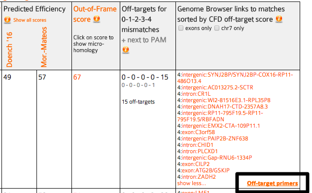

You reach the off-target primer designer by fist clicking "show all" in the
list of off-targets, then following the link "Off-target primers". At
the top of the page, a table with one pair of primers for every predicted
off-target is shown. 

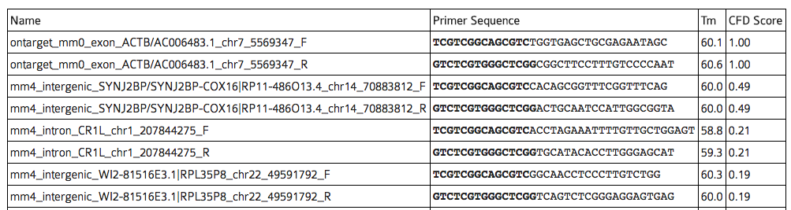

In the table of primers output by CRISPOR, Illumina Nextera Handle sequences
have been added and are highlighted in bold. Primers for the on-target sequence
have been added for convenience.  The table is sorted by the CFD
off-target score.  Note that sites with very low CFD scores < 0.02 are unlikely to be
cleaved, see Figure 2 of our [CRISPOR
paper](http://genomebiology.biomedcentral.com/articles/10.1186/s13059-016-1012-2),
but they are still shown on this table. All primer names are prefixed by the number
of mismatches, e.g. "mm4" is an off-target with four mismatches. Naturally,
each off-target has two primers, indicated by the common suffixes "\_F" and
"\_R".

The primer designer also outputs a table of the amplicons with the putative
off-target sequence highlighted in bold.

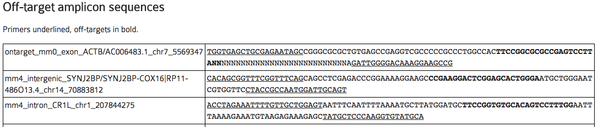

Finally, at the end of the page, you can download CRISPRESSO input files and the exact
command line to analyze your FASTQ sequencing result file.

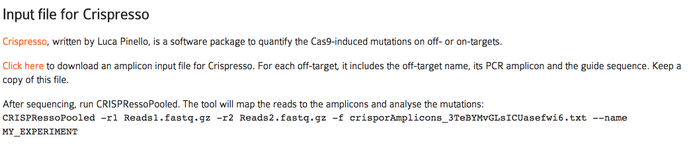

CRISPOR saturating mutagenesis assistant {#satMut}
========================================

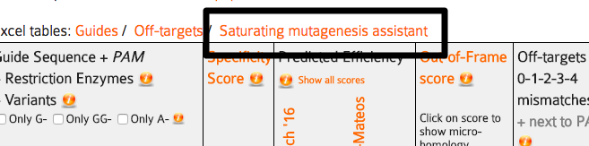

In a saturating mutagenesis experiment, a target region of the genome is
modified with many guides, to create as many DNA edits as possible. Cells can
be transfected with a pool of oligonucleotides ("pooled") or one guide per
cell sample on plates ("arrayed") and are then phenotyped. This assay is usually
used for cis-regulatory regions, to find the relevant sequences for a phenotype.
Pools with up to several thousand guides can be ordered from custom oligonucleotide array
manufacturers, containing subpools of guides that can induce thousands of deletions into
a target sequence.

To save money, you usually order several libraries together as a single pool.
Each library has a unique barcode and you can amplify a library from it with PCR
and the unique barcode as a primer.

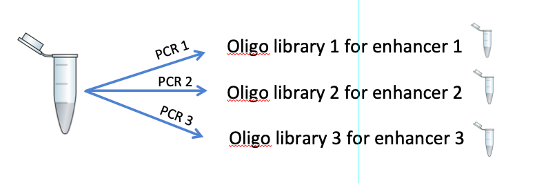

The CRISPOR Saturating mutagenesis assistant makes this much easier by generating
tables with all relevant guides in a target sequence, prefixed with the right
adapter sequences, input files for CRISPRESSO to quantify the guides (see
[off-target primers](#other)) and sequencing primers to validate the modifications.

For step-by-step details on how to conduct this assay and use this assistant, please refer
to our pre-print, [Canver et al.
2017](http://www.biorxiv.org/content/early/2017/09/11/125245),
to appear in Nature Protocols in 2018.

CRISPOR Batch {#batch}
=============

Pooled CRISPR screens can be used to knock-out thousands of genes with a single
experiment. CRISPOR Batch makes the design of an oligonucleotide pool very
easy: paste a list of genes, then download a table of oligonucleotides. We currently
only offer this for human and mouse, let us know if you need another organism.
We also do not design the oligonucleotide libraries but instead offer existing
and tested sequences from published libraries. To reach CRISPOR batch, follow the link to 
it from the main page.

Select the CRISPR library, the number of negative controls, the number of
guides you need per gene, then paste a list of gene gene symbols, Entrez Gene
IDs or Refseq IDs, one per line into the box below.

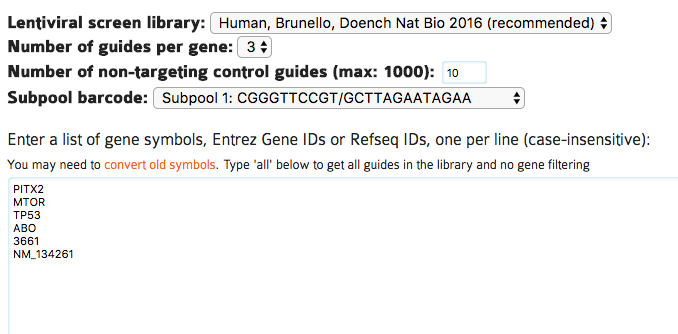

The output page contains a table with one row per guide, for up to the number of
guides per gene that you selected.

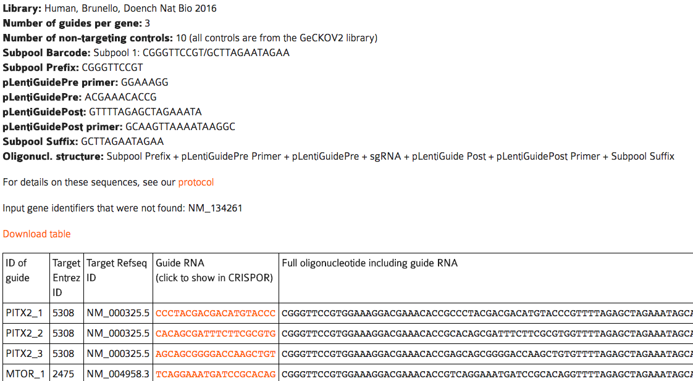

A note on money: pooled screens may seem like an expensive assay, but at
current prices you can get twelve thousand oligos for < 2000$
and the pool can easily be split into smaller subpools by PCR. In addition,
there is a lot of competition in this field. Our collaborator Matt Canver uses
CustomArray which says they will beat any quote. If you order through Twist
Biosciences, mentioning CRISPOR will get you 35% off your order (we do not
receive kick-backs from them, unfortunately).

Notes on off-target cleavage {#offs}
============================

Off-target effects are a somewhat controversial topic. On the one hand, cleavage
at unintended locations in the genome is a major concern,
it is important enough to get mentioned in [newspaper
articles](https://www.nytimes.com/2015/11/15/magazine/the-crispr-quandary.html) and
has lead to [stockmarket changes and calls for study
retractions](http://retractionwatch.com/2017/07/26/controversial-crispr-paper-earns-second-editorial-note/).
On the other hand, if you are working with mice, worms or flies, and you are
breeding out for a few generations after your genome edits, then you are probably
not worried at all, as unrelated mutations are most likely get removed over time.
In this case, you can probably skip this section, just avoid guides with
very low specificity scores and possibly use the "same chromosome" filter in
[column 7](#col7) of the guide list to show only off-targets that are on the
same chromosome, so less likely to get removed by back-crossing.

For other researchers, e.g. those that use mice without further inbreeding or
work on cell cultures or on medical applications, the off-target issue needs to
be addressed. Here is a quick summary of what is relatively well-known about
off-targets:

- in very small genomes, like bacteria or viruses, it is unlikely to find
  similar sequences to a 20mer and off-targets are rarely a problem
- off-target effects primarily depend on the guide sequence. A
  guide sequence that is entirely different from every 20mer in the genome
  (e.g. many guides targeting GFP) is extremely unlikely to cut anywhere else
  than at its target site
- as such, any results you have heard from colleagues about hundreds of
  off-targets apply to their particular guides and may not be relevant for your
  guides.
- the more mismatches the off-target has relative to the guide, the less likely
  it is that the off-target is a problem. 
- mismatches that are close to the PAM site make it less likely that the off-target
  is a problem.
- certain nucleotide changes (e.g. C->T) at certain positions make it less
  likely that the off-target is a problem.
- off-targets cannot be predicted entirely, these rules are not everything.
  There still are a handful of known, strong off-targets that are
  unexplainable. Their differ from the guide at many positions,
  yet are strongly cleaved even in-vitro assays of naked DNA (no chromatin structure)
- a few known off-targets, not more than 3-4 in total, to our knowledge, seem to
  have one-basepair insertions or deletions relative to the guide
- new high-fidelity versions of SpCas9 can reduce the off-target effects, but 
  not to 0, there still will be some cleavage on some sites (more on this later)

CRISPOR aligns the guides against the genome, reports those locations with a similar
sequence in the genome ("predicted off-targets"),
ranks these and then based on their scores, ranks the guides.

When predicting off-targets, CRISPOR searches the whole genome (including
repeated regions) and allows up to four mismatches. It is important to search
repeats, as they are part of the genome, but you may wonder why we chose four
mismatches. When we looked at real off-targets, around 90% of them had not more
than four mismatches. While you can increase the number of allowed mismatches
using the command line version of CRISPOR to five or even six mismatches, the
large majority of the predicted locations will be false positives, and most
guides would require thousands of PCRs to check all predicted off-targets with
more than four mismatches. See Figure 1 of the [CRISPOR
paper](http://genomebiology.biomedcentral.com/articles/10.1186/s13059-016-1012-2).

CRISPOR then ranks the putative off-target sequences by a score called "CFD",
created by John Doench and colleagues in [his 2016
paper](https://www.ncbi.nlm.nih.gov/pmc/articles/PMC4744125/).  We have
evaluated four different scores in (Figure 2 of the [CRISPOR
paper](http://genomebiology.biomedcentral.com/articles/10.1186/s13059-016-1012-2))
and found the CFD score more accurate than the others. 

CRISPOR summarizes all of the putative off-target sites it finds in the genome for
one guide into the "guide score", a formula we copied from the [MIT CRISPR
website](http://crispr.mit.edu).
The "Hsu" score itself was never published, but is based on data from a paper
by [Patrick Hsu](https://www.nature.com/articles/nbt.2647).  While we use
Patrick Hsu&lsquo;s formula like the MIT site, CRISPOR searches go up to four
mismatches, and the MIT website uses three mismatches and does not search
repeats, so the guide scores are not exactly identical. CRISPOR is more
sensitive, but in practice most guides with a low score on the MIT website will
also have a low score with CRISPOR. The commercial solutions Benchling and
DeskGen are also less sensitive, so their scores differ, but ChopChop and
Cas-OffFinder should give identical off-target results to CRISPOR.

So how many off-targets should you expect? We studied this question in
Figure 3 of the [CRISPOR
paper](http://genomebiology.biomedcentral.com/articles/10.1186/s13059-016-1012-2).
It is based on 30 guides that were tested for off-targets with high-throughput
assays by various labs.

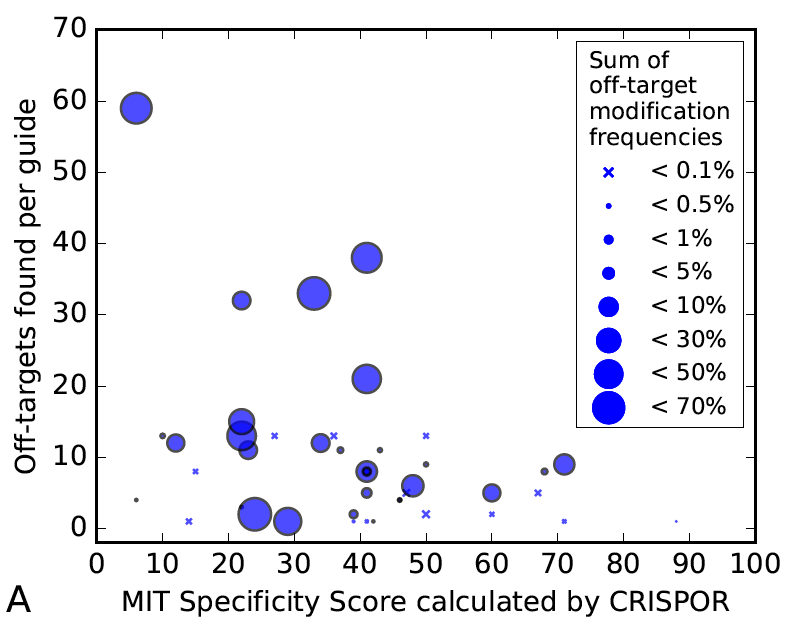

The figure shows that there are some guides that have virtually no off-targets, but in general,
there is a decreasing tendency of strong off-target effects when the specificity is higher. 
It also shows that too many tests have been done for low-specificity guides, which may explain
why you have heard from colleagues that hundreds of off-target sites are common. It also shows
that the accuracy of the prediction is not great, the current predictions have
some value, but there is no guarantee that you can avoid off-target effects
with a software like CRISPOR alone.

Therefore, if you are worried about off-target effects, you can either
test your guide for off-targets with a high-throughput technique in cell cultures (e.g.
guideSeq or DiGenomeSeq2), which will require learning a new assay. The alternative is
to test predicted off-target sites by a simple PCR and next-generation
sequencing (or use TIDE, knowing that it will not find the weaker off-targets).
For a highly specific guide, this may involve only a few dozen PCRs and
[CRISPOR&lsquo;s Off-target
primer designer](#otPrimers) makes their design very easy. This is the other
good reason to use only very specific guides: you can screen all predicted
off-targets by PCR.

How many off-targets should you test, especially since there are often 
hundreds of predicted sites and only very few real off-targets among them?
There is not enough data to answer this question completely, but here are a few
examples ([complete histograms](fig/guideCfdHist.png)):

- the most unspecific guide that we know, VEGFA_site3 from the GuideSeq
 paper, responsible for the majority of all known off-targets to
 date, has a MIT specificity score of only 6. GuideSeq found 32 off-targets 
 in Tsai et al, but 4450 off-targets are predicted by CRISPOR. If
 you sequence only the off-targets with a CFD score over 0.2, then you have to
 test 274 potential off-targets but still find 24 real off-targets among
 them.
- the somewhat more specific guide EMX1, MIT score 21, has 11 real off-targets
 found by GuideSeq and 1026 predicted off-targets. There are only 143
 off-targets with a CFD > 0.1, which still catches 10 out of the 11 real
 off-targets. This is somewhat more than a 96-well plate but still doable.
- the VEGFA guide from the DiGenomeSeq paper has a reasonable specificity of 42. 
 You may not want to test all 719 CRISPOR predictions, but if you limit
 yourself to the ones with a CFD > 0.1, you have to sequence only 75 and still find
 21 out of the 24 known off-targets.
- guides with a higher specificity have very few off-targets and almost all of them
 will be found by testing predictions with CFD scores > 0.1. This requires
 testing 30-70 off-targets.

It seems that if your guide has a reasonable specificity score, testing one
96-well plate of primers should find most off-targets.

Should you use a high-fidelity version of SpCas9, eSpCas9 1.1 or HF1? If
you are worried about off-targets, then probably yes. Just do not be surprised
that these enzymes are less efficient on many target sites or may
not even be able to cleave some target sites at all. If you use them, you may
want to try both enzymes or be ready to fall back to the original SpCas9.
[Kulcsar et al.
2017](https://genomebiology.biomedcentral.com/articles/10.1186/s13059-017-1318-8)
have studied this topic in detail and shown that there is a ranking from the
best to the worst enzyme in terms of efficiency, but the order was different
for every target site they tested.

<!-- There are at least two
other scores that we aware of that are not in CRISPOR, one is unpublished and one
too slow for a website (Elevation and CRISTA). -->

Notes on on-target cleavage {#onEff}
===========================

On-target efficiency, the percentage of cells with a DNA modification of the
target sequence, can vary a lot between guides. The general
recommendation is to first test several guides, often three, around a target
sequence and then use the best one. Quite a few labs have looked at their
CRISPR results post-hoc to determine features of their most efficient guides.
Initially, these were rules, derived from smaller worm or fly datasets, and 
lead to guidelines like "prefer guides with Gs at the 3' end". Later, pools of
thousands of guides were tested in cell cultures or, one by one, expressed
in-vitro and injected into zebrafish. The results of these assays were run
through machine learning algorithms to build models that predict the efficiency
from on the guide sequence alone.

In our [CRISPOR paper](http://genomebiology.biomedcentral.com/articles/10.1186/s13059-016-1012-2)
we conducted the most comprehensive comparison of these prediction models at
the time. No matter the model, their value is limited, they can
explain only ~40% of the variation between different guides.
The unexplained part does not seem to depend on the chromatin structure or the
other possible factors that the studies have tested. Therefore, when looking
at your own results, if you compare only a few guides, you may not see a
significant correlation of your results against the prediction scores. In
addition, if you use a very inaccurate method to quantify your efficiency, like
the T7 endo assay, many differences will not be visible.  Finally, according to
a Synthego slide deck, synthetic RNA guides do not seem to have this link
between sequence and efficiency at all (watch this space, we will follow up on
this soon).

Nevertheless, if you plan to test more than just a few guides, the
efficiency prediction scores do enrich for more efficieny guides.
We found that there is one important parameter
when choosing a score, it is the way you express your guides. T7
in-vitro expressed guides - injected into e.g. mouse or Xenopus eggs - behave very
differently from U6 guides expressed from plasmids that have been transformed into
cell cultures. In our analysis, the score by Moreno-Mateos et al. worked better
for T7 datasets, and the one by Doench et al. 2016 was best for U6 datasets,
see Figure 5 of our [CRISPOR paper
paper](http://genomebiology.biomedcentral.com/articles/10.1186/s13059-016-1012-2).

The influence of the efficiency score on the measured cleavage is shown in the
diagram below: the y-axis shows the Doench2016 score range and 
next to each range, a histogram illustrates how many of the tested guides in this
range where among the top 25% efficient guides (green) and how many where among the 
bottom 25% guides (red) in the whole dataset. Light-red and yellow are the intermediate
quartiles. You can see that when guides were tested in the 90-100 score range,
very few of them were in the least efficient quartile. In the 10-20 score range,
a majority of guides were not very efficient. This is not due to "over-fitting",
because the diagram shows the Hart 2016 experiment, which was not published yet
when Doench 2016 was accepted.

The lower diagram shows the same for zebrafish data, but since the dataset
from the same authors is plotted here, the results are probably too good
and should be somewhat worse in practice, more like the cell culture diagram.

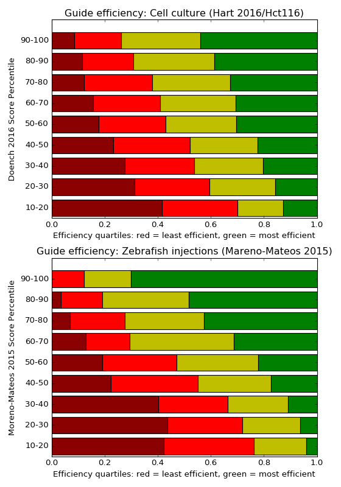

{#graf}
A special case of efficiency scoring are the [Graf et
al](https://www.ncbi.nlm.nih.gov/pmc/articles/PMC6352712/) motifs. The authors
claim that certain nucleotide sequences (two to 16, depending on how you count)
at the end of the guide lead to extremely low efficiency. This is already
captured by the efficiency scores, as shown below. But the simple nature of the
Graf et al. motifs makes these guides easy to avoid.

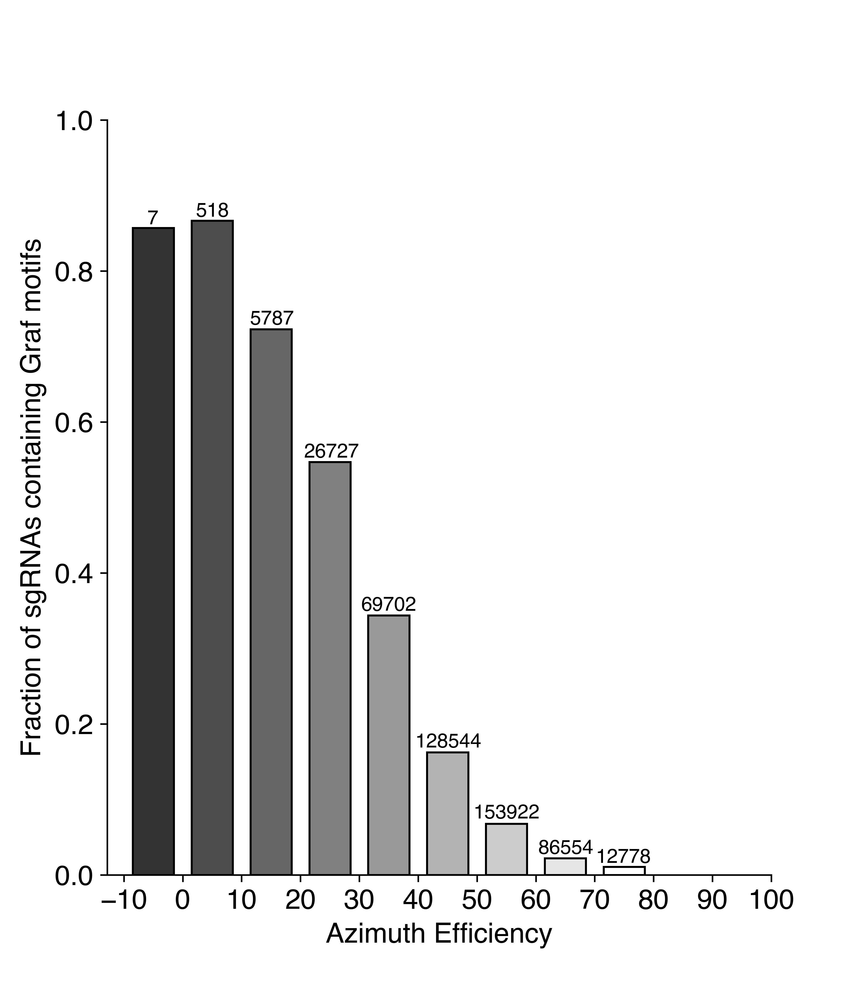

So while you may have heard that efficiency predictions are of little value,
we still recommend them. They should save screening time in the long run as
they decrease your chances of stumbling over a very inefficient guide.
Just make sure that you look at the right score for your expression system.

Notes on enzymes {#enzymes}
================

Cpf1/Cas12a: the original paper described 23bp guides. For higher efficiency, 21bp guides are
recommended by IDT [on the Cpf1 product
page](http://www.idtdna.com/pages/products/crispr-genome-editing/alt-r-crispr-cpf1-genome-editing), Figure 3, 
in the "performance" section.

Adding a genome {#addgenome}
===============

If you need a genome that is not already in the our list, please send us the
UCSC genome name or the Ensembl taxon ID or the NCBI RefSeq Assembly ID, which
starts with GCF_ or GCA_. GCF_ genomes come with 
gene models, for exon filtering, GCA_ accessions do not, so when in doubt,
prefer GCF_ genomes.  You can find these numbers by searching [NCBI
Assembly](https://www.ncbi.nlm.nih.gov/assembly) for your genome of interest. 
We can exceptionally also add individual FASTA and GFF files, which you can
send by URL or as a Dropbox link. We have received more than 150 genomes from
users by email until now, mostly using NCBI RefSeq genome accessions.

Frequently Asked Questions {#faq}
==========================

* Why is the MIT score (aka Hsu score) displayed by CRISPOR different from the
    ones displayed by the MIT website, Desktop Genetics or Benchling?

Because these other tools do not find as many off-targets as CRISPOR. As we
have shown in our paper, CRISPOR finds all off-targets with 4 mismatches. The MIT
websites does not find all off-targets, because it filters for repeats.
Benchling misses some off-targets, not as many as the MIT website but still a
high number. We do not know why, but it may also be related to repeats. Desktop
Genetics only can find off-targets with up to three mismatches, so their MIT score
is also slightly different.

* What is the CFD Specificity score?

The MIT Guide Specificity score summarizes the individual Hsu MIT off-target scores for
all off-targets of a guide, 100/(100+sum(mitScores)).  The more recent and more
accurate CFD off-target score by Doench et al. is not defined on the level of
guides.  As a result, the authors of GuideScan.com have inventend a new guide
specificity score, by taking the taking the sum of all CFD scores for all
off-targets of a guide and taking 100/(100+sum) of that. Since May 2019, we are
also showing this score for guides, in addition to the MIT score. This is based
on comparisons done by Josh Tycko, shown below, that show a better correlation of the 
CFD specificty score with total off-target read fraction than with MIT specificity score.

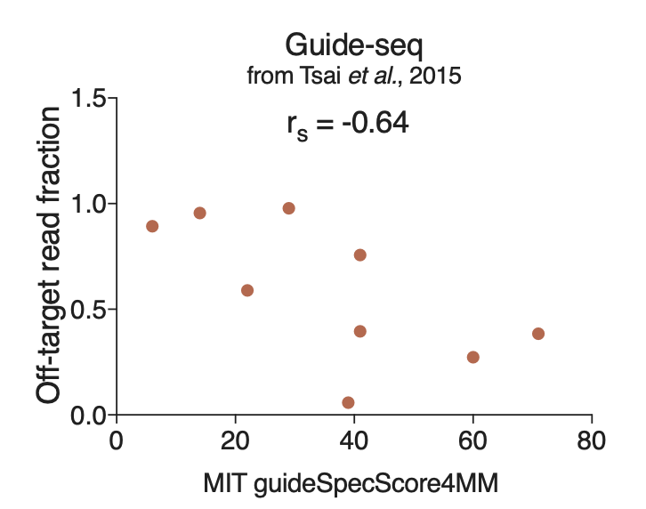

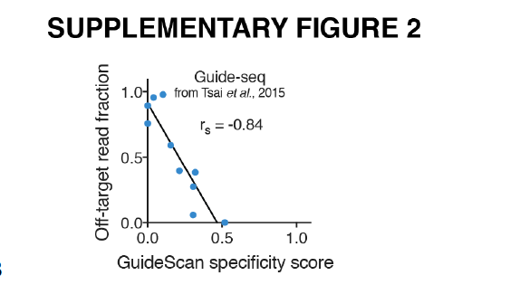

For a given guide, the GuideScan specificity score is not exactly the same as
the Crispor CFD specificity score, even though they both use the same formula:
CRISPOR considers all genome sites with 4 mismatches as off-targets, where
GuideScan uses only 3 mismatches. As shown above and in our paper, we think 4
mismatches is a better parameter for off-target searches than 3.

* Can I score my existing single guides with CRISPOR ?

Of course, just paste the target sequence, i.e. the guide + the PAM sequence, into the sequence input box.

* Can you add my genome and not share it?

Yes, we can add private genomes. People can use them on the website, but they
will not be able to download the genome. Just tell us that the genome is
private and shall not be downloadable.

* Can you add my genome? By the way, it is 10GB big.

This is tricky. The problem is usually not the size of the genome, but rather the 
insane number of contigs (often several millions) which makes sequence searches very slow.
Searching such a number of sequences takes forever and will make the website
unusable for other users.  One solution is to reduce the number of contigs, by
concatting all smaller ones into a single "chrU" contig, like in the older human
genome versions. Another solution is for you to setup your own personal CRISPOR
website with just your genome. See the [Downloads](/downloads/) page at
the bottom of the CRISPOR start page to learn more and [contact us](mailto:crispor@tefor.net) for help.

* Can I search for 19bp long guides?

Yes, but only with the CRISPOR command line version. It has the --shortGuides option.
Look for the command line version on our [Downloads](/downloads/) page. If you have trouble,
email us. Because of their lower efficiency, we do not recommend
19bp long guides and do not offer this option on the website. If you think this is a mistake,
let us know.

* Does CRISPOR support nickases?

Nickases are a variant of Cas9 that require two guides with targets very close to each other and
both have to cut for a successful genome edit. We have
received numerous reports that two guides are a lot less efficient than single guides and
less specific than the new high-specificity Cas9 enzymes. We have no plans anymore to support 
explicit two-guide nickase designs. If you think that this is a mistake, let us
know, but for now, we do not recommend the double-guide nickase strategy
anymore. We rather recommend eSpCas9 1.1 or SpCas9-HF1 and single guides.
